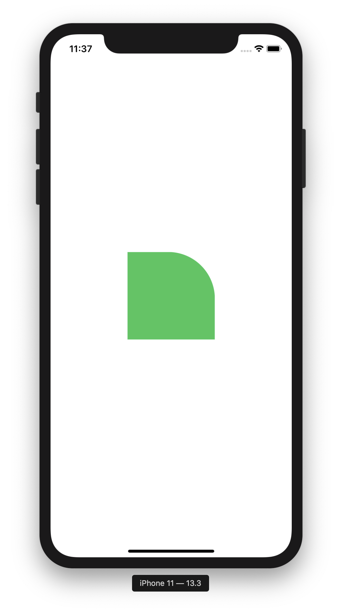

# ArcDraw

> UIView 우측 상단만 round 되도록 함



- 다음 코드를 이용해 corner 위치를 지정할 수 있다.

```swift
self.layer.maskedCorners = [.layerMaxXMinYCorner]
```

- `.layerMaxXMinYCorner` : 우측상단 corner
- `.layerMaxXMaxYCorner` : 우측하단 corner
- `.layerMinXMaxYCorner` : 좌측하단 corner
- `.layerMinXMinYCorner` : 좌측상단 corner
